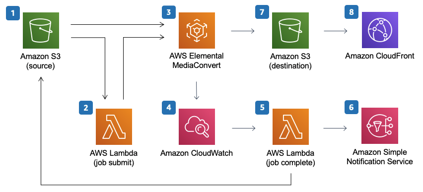

# Video on Demand on AWS Foundation

[Implementation Docs](https://docs.aws.amazon.com/solutions/latest/video-on-demand-on-aws-foundation/solution-overview.html)

## Solution Overview

### Required AWS Service components

1. **AWS Elemental Media Convert**  
   To transcode media files from their source format into versions that play back on most user devices.
2. **Amazon CloudFront**  
   For global distribution.
3. **Amazon S3**  
   For object storage
4. **AWS Lambda**  
   To run code without provisioning or managing servers.
5. **Amazon CloudWatch**  
   To track encoding jobs in MediaConvert.
6. **Amazon SNS**  
   To send notifications for completed jobs.

## Cost

The total cost for running this solution depends on

1. the size of the videos,
2. the number of outputs created, and
3. the number of views the published content receives through Amazon CloudFront.

| AWS Service                | Picing        | Dimension (5 minutes video)          | Cost per Month |
| -------------------------- | ------------- | ------------------------------------ | -------------- |
| Amazon CloudFront          | $0.085 per GB | 0.75 MB/s _ 1000 users _ 300 seconds |
| Amazon S3                  |               |                                      |
| AWS Lambda                 |               |                                      |
| Amazon CloudWatch          |               |                                      |
| Amazon SNS                 |               |                                      |
| AWS Elemental MediaConvert |               |                                      |

## Architecture Overview

The architecture is made up of the following components

1. An S3 bucket to store source video files and job settings files used to define the encoding settings for MediaConvert.
2. An Lambda job submit function to create the encoding jobs in MediaConvert
3. MediaConvert to transcode the video into HLS _Adaptive Bitrate_ files.
4. Amazon CloudWatch to track encoding jobs in MediaConvet and invoke the Lambda job complete function.
5. A Lambda job complete function to process te output.
6. An SNS topic to send notifications of completed jobs.
7. A destination S3 bucket to store output from MediaConvert.
8. A CloudFront distribution with and S3 bucket as origin for distribution of the transcoded video.

## Solution Components

**Ingest**  
The work flow starts when a video in uploaded into a _folder_ in the source S3 bucket. A `job-settings.json` file is also uploaded to the same _folder_ is also required for use by the Lambda function.

**Encoding**

**Processing**

For information on how to secure Amazon CloudFront, refer to [Serving private content with signed URLs and signed cookies](https://docs.aws.amazon.com/AmazonCloudFront/latest/DeveloperGuide/PrivateContent.html)

## Monitoring the solution with AppRegistry
