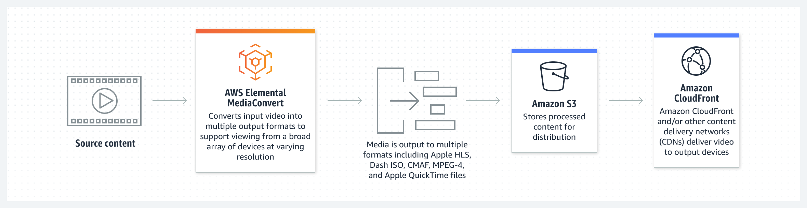

# AWS Elemental MediaConvert  
[MediaConvert](https://docs.aws.amazon.com/mediaconvert/index.html)   
[User Guide](https://docs.aws.amazon.com/mediaconvert/latest/ug/what-is.html)    
[API Reference](https://docs.aws.amazon.com/mediaconvert/latest/apireference/custom-endpoints.html)   

## Introduction  
AWS Elemental MediaConvert is a file-based video transcoding service with broadcast-grade features. Create live stream content for broadcast and multi-screen delivery at scale.


Process video files to prepare on-demand content for distribution or archiving.

MediaConvert has the following components:
1. __Jobs__  
A job does the work of transcoding. Each job converts an input file into an output file or files.
2. __Queues__  
A queue allows you to manage the resources that are available to your account for parallel processing of jobs.
3. __Presets__  
A preset is a saved group of encoding settings for a single output.  
4. __Job templates__  
A _job template_ specifies all the settings for a complete job, except for your IAM role and those settings that are likely to change for each job, such as the input file location and name, and user metadata that you might tag the job with.  

## Getting Started  
MediaConvert takes in an input file and the information that you provide about that file and turns it into one or more output files, based on the instructions and transcoding settings that you provide.
To convert an exaple video using MediaConvert
1. __Create storage__  
Create two buckets for input and output files
```
$ aws s3 mb s3://tochukwu-media-convert-input
$ aws s3 mb s3://tochukwu-media-convert-output
```
2. __DRM encryption__  
Optionally you can encrypt your content using DRM encryption to protect your content from unauthorized.  
3. __Upload files for transcoding__   
Copy a video input file to the input s3 bucket.
```
$ aws s3 cp Robin-Thicke_Blurred-Lines.mp4 s3://tochukwu-media-convert-input
```
MediaConvert may also accept an HTTP(S) endpoint as the file input source instead of an S3 path.  
See [supported input type](https://docs.aws.amazon.com/mediaconvert/latest/ug/reference-codecs-containers-input.html)  

4. __Set up IAM permissions__   
An IAM service role is needed to allow MediaConvert access to your resources, such as your input files and the locations where your output files are stored.   
First create a role with a defined trust policy. A trust policy specifies which IAM entities (accounts, users, roles, services) can assume the role.  
```
$ aws iam create-role --role-name MediaConvertS3Role --assume-role-policy-document file://trust-policy.json
```
Attach a policy to the role
```bash
$ aws iam put-role-policy --role-name MediaConvertS3Role --policy-name S3ReadWritePolicy --policy-document file://s3-permission.json
# Check the policies attached to the role
$ aws iam list-role-policies --role-name MediaConvertS3Role
```
Inline policies have a one-to-one relationship with the Principal (role, user or group). This means that if we delete the IAM role, the inline policy also gets deleted.


__Resources__  
[Create a Role with AWS CLI - Complete Guide](https://bobbyhadz.com/blog/aws-cli-create-role)    
[AWS IAM Policies with Examples](https://medium.com/tensult/aws-policies-with-examples-8340661d35e9)   
[AWS IAM Policies : Creating an IAM Policy & Best Practices](https://spacelift.io/blog/iam-policy)   
[List of AWS Service Principals](https://gist.github.com/shortjared/4c1e3fe52bdfa47522cfe5b41e5d6f22)   
