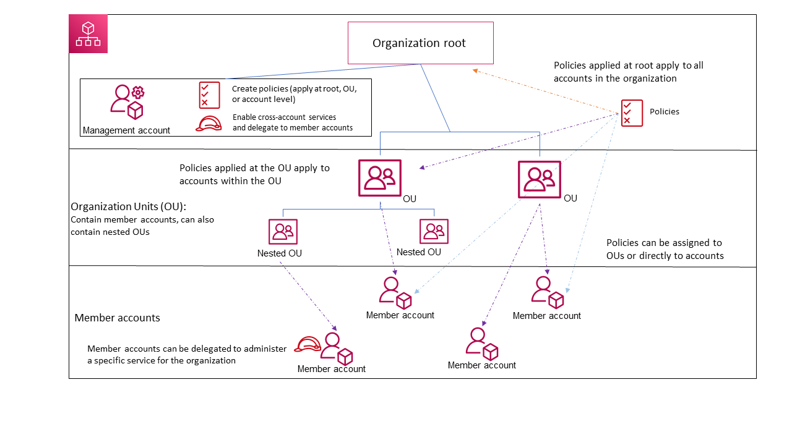

# AWS Organizations  
[User Guide](https://docs.aws.amazon.com/organizations/latest/userguide/orgs_introduction.html)  
[API Reference](https://docs.aws.amazon.com/organizations/latest/APIReference/Welcome.html)  
[CLI Reference](https://awscli.amazonaws.com/v2/documentation/api/latest/reference/organizations/index.html)  

### Introduction
AWS Organizations is an account management service that enables you to consolidate multiple AWS accounts into an organization that you create and centrally manage.  

You can define conditions for when to restrict access to AWS services, resources, and API actions. These restrictions even override the administrators of member accounts in the organization. When AWS Organizations blocks access to a service, resource, or API action for a member account, a user or role in that account can't access it. This block remains in effect even if an administrator of a member account explicitly grants such permissions in an IAM policy.
In other words, the user can access only what is allowed by both the AWS Organizations policies and IAM policies. If either blocks an operation, the user can't access that operation.

#### AWS Organizations terminology and concepts
__Organization__  
An entity that you create to consolidate your AWS accounts so that you can administer them as a single unit. An organization has one management account along with zero or more member accounts. An organization has the functionality that is determined by the feature set that you enable.  

__Root__  
The parent container for all the accounts for your organization. If you apply a policy to the root, it applies to all organizational units (OUs) and accounts in the organization. AWS Organizations automatically creates it for you when you create an organization.  

__Organizational unit (OU)__  
A container for accounts within a root. An OU also can contain other OUs, enabling you to create a hierarchy that resembles an upside-down tree, with a root at the top and branches of OUs that reach down, ending in accounts that are the leaves of the tree.  

__Account__  
An account in Organizations is a standard AWS account that contains your AWS resources and the identities that can access those resources.  
An AWS account isn't the same thing as a user account. An AWS user is an identity that you create using _IAM_ and takes the form of either an IAM user or an IAM role. A single AWS account can, and typically does contain many users and roles.  
There are two types of accounts:
1. __Management account__ is the account that you use to create the organization. The management account has the responsibilities of a _payer account_ and is responsible for paying all charges that are accrued by the member accounts. You can't change an organization's management account.
2. __Member accounts__ make up all of the rest of the accounts in an organization. An account can be a member of only one organization at a time.

__Invitation__  
The process of asking another account to join your organization. An invitation can be issued only by the organization's management account. Invitations work by accounts exchanging handshakes.

__Handshake__  
A multi-step process of exchanging information between two parties. You generally need to directly interact with handshakes only if you work with the AWS Organizations API or command line tools such as the AWS CLI.  

__Available feature sets__  
* __All features__ – The default feature set that is available to AWS Organizations. To enable all features, all invited member accounts must approve the change by accepting the invitation that is sent when the management account starts the process.
* __Consolidated billing__ – This feature set provides shared billing functionality, but doesn't include the more advanced features of AWS Organizations.

__Service control policy (SCP)__  
A policy that specifies the services and actions that users and roles can use in the accounts that the SCP affects. When you attach an SCP to your organization root or an OU, the SCP limits permissions for entities in member accounts.  

__Allow lists vs. deny lists__
* __Allow list strategy__ –  You explicitly specify the access that is allowed. All other access is implicitly blocked.
* __Deny list strategy__ – You explicitly specify the access that isn't allowed. All other access is allowed.
This is the default behavior of AWS Organizations.

__Artificial intelligence (AI) services opt-out policy__  
As an AWS customer, you can use AI service opt-out policies to choose to opt out of having your content stored or used for service improvements.

__Backup policy__
In a backup policy, you can configure and deploy backup plans for your resources.

__Tag policy__  
In a tag policy, you can specify tagging rules for specific resources.

  
_Account Organizational Unit_

## Tutorials
#### Tutorial 1: Creating and configuring an organization
__Step 1__: Create your organization.  
The account whose user is calling the _CreateOrganization_ operation automatically becomes the management account of the new organization.
```
$ aws organizations create-organization
```
If the account you use has never had its email address verified by AWS, a verification email is automatically sent to the address for verification.

If your want the organization to be created withonly consolidated billing features enabled
```
$ aws organizations create-organization --feature-set CONSOLIDATED_BILLING
```

__Invite an existing account to join your organization__  
__Step 2__:

Invite an existing account using the account's associated email address
```
$ aws organizations invite-account-to-organization --target '{"Type": "EMAIL", "Id": "bbdchucks@gmail.com"}' --notes "This is a request for Chucks  account to join Tochukwu's organization."
```
Alternately, you can invite an existing account using the account id
```
$ aws organizations invite-account-to-organization --target '{"Type": "ACCOUNT", "Id": "966727776968"}' --notes "This is a invitation for Chucks  account to join Tochukwu's organization."
```
After you create an organization and before you can invite accounts to join, you must verify that you own the email address provided for the management account in the organization.

__Viewing the details of an organization__  
```
$ aws organizations describe-organization
```  

__Delete the organization__   
```
$ aws organizations delete-organization
```
